#  UnMTP

> **A blazing-fast, cross-platform and bi-directional two-phase hybrid file transfer tool for moving files between Android (Termux) and Windows (or any Android/Windows combination) over local network with OS-level optimizations — no USB cable, no cloud, no nonsense.**

---

## ✨ Features

- **OS Fingerprinting & Cross-Platform Support** — Fully OS-aware using Python's `os.name`. Runs bi-directionally (Windows-to-Android, Android-to-Windows, Windows-to-Windows) over local Hotspot/LAN without losing system-specific optimizations.
- **Zero-Copy Kernel Streaming** — Files ≥ 5 GB are transferred using `socket.sendfile()`, which leverages the OS kernel's `sendfile(2)` syscall to move data directly from the file descriptor to the network socket, bypassing userspace buffers entirely. Minimal CPU and RAM overhead.
- **Streaming Tar Pipe** — Everything under 5 GB is bundled into a live, unbuffered tar archive (`mode='w|'`) and piped straight through the socket. No intermediate archive is written to disk.
- **Auto Gateway Detection on Windows** — When the pull client runs on Windows, it automatically detects your phone's IP by querying the default gateway via PowerShell (`Get-NetRoute`) with a fallback to parsing `ipconfig` output. On Android/Linux, it gracefully skips Windows-specific queries and prompts for manual IP entry.
- **Zero External Dependencies** — Runs entirely on the Python standard library. No `pip install`, no `requirements.txt`, no virtual environments.
- **Tilde (~) Path Expansion** — Both scripts natively expand home directory paths (`~/...`) using `os.path.expanduser()`, ensuring correct path resolution when typing paths manually.
- **Cross-Platform Path Normalization** — Automatically translates Windows-style backslashes (`\`) to forward slashes (`/`) before transferring over the network, ensuring seamless file creation across POSIX and Windows filesystems.
- **Interactive Retry Loop** — Connection failures are handled gracefully with user-friendly prompts, IP re-entry, and retry options.
- **Write Permission Validation** — The client verifies actual write access to the destination directory by creating and deleting a test file before initiating the transfer.
- **Preserves Directory Structure** — The full folder tree is reconstructed on the receiving end exactly as it exists on the source device.
- **8 MB Socket Buffers** — Both send and receive buffers are tuned to 8 MB for sustained throughput on gigabit-class Wi-Fi connections.

---

## Why UnMTP? (The Intuition)

This project was born out of a stark hardware limitation: **Moving a ~100 GB file structure over a legacy USB 2.0 wire is agonizingly slow, yet mainstream wireless tools completely choke on the payload.**

### 1. The Hardware & Software Dead-End
My laptop and phone are modern, high-performance machines, but they are physically bound by a legacy **USB 2.0 port data cap (write speeds often range from only 3–10 MB/s, while read speeds may hit 10–25 MB/s)**. Turning to standard wireless alternatives like KDE Connect, LocalSend, or Blip didn't work either—these apps are built for casual media sharing (.bin files). They lack proper low-level optimization, add immense protocol overhead, and frequently crash or drop packets when forced to handle massive, deeply nested directory structures (like compressed game repacks).

### 2. Generalizing the Topology (Cross-Platform & Bi-Directional Host/Client)
Previously, the transfer architecture was restricted to a rigid configuration: Android acts strictly as the Server (Host) and Windows acts strictly as the Client (Pull). To expand utility while preserving high performance, we updated both scripts to detect the operating system at runtime using `os.name`. Now, the host and client scripts are fully bi-directional and cross-platform (e.g., Windows-to-Android, Android-to-Windows, Windows-to-Windows, etc.) over a local Hotspot/LAN, adapting their default directories and network detection workflows dynamically.

### 3. The Evolution: Merging Two Worlds into One Infrastructure
During development, I built two entirely different technical approaches to solve this:
* **The Tar Stream:** Excellent for keeping momentum through small files, scripts, and nested subfolders.
* **The Zero-Copy (`sendfile`):** Unbeatable for blasting singular, monolithic multi-gigabyte assets straight to the network card without touching the CPU.

**The Meaningful Inference:** One size doesn't fit all. Instead of compromising, I merged both variations into a singular, automated **Hybrid Infrastructure**. The code dynamically scans the folder on launch: it handles the massive multi-gigabyte files via kernel-level Zero-Copy pipelines, then instantly state-shifts to a Live Tar stream to sweep up the remaining small assets. 

It is a custom solution built because off-the-shelf software simply couldn't handle the scale.

---

## 📋 Prerequisites

Since UnMTP is now fully cross-platform, you can run the Host (Server) and Pull (Client) on either Windows or Android (Termux). The requirements below apply depending on where you run each script:

| Requirement | If Running on Android (Termux) | If Running on Windows PC |
|---|---|---|
| **Python** | Python 3.8+ (via Termux) | Python 3.8+ |
| **Network** | Shared Local Hotspot / LAN | Connected to same Hotspot / LAN |
| **Storage Access** | Termux storage permission granted | Write access to destination folder |
| **Firewall / Port** | Port `5001` must be open | Port `5001` must not be blocked |

> [NOTE]
> Both devices **must** be on the same local network. This tool does not work over the internet.

---

## 🛠️ Installation

### 🤖 Android (Termux) — Host/Server Setup

**Step 1: Install Termux**

Download and install Termux from [F-Droid](https://f-droid.org/en/packages/com.termux/) (recommended) or the [Termux GitHub Releases](https://github.com/termux/termux-app/releases).

> [!WARNING]
> **Do NOT install Termux from the Google Play Store.** The Play Store version is outdated and no longer maintained. It will cause package installation failures.

**Step 2: Update packages and install Python**

Open Termux and run:

```bash
pkg update && pkg upgrade -y
pkg install python -y
```

**Step 3: Grant storage access**

```bash
termux-setup-storage
```

A permission popup will appear — tap **Allow**. This creates symlinks at `~/storage/` pointing to your internal storage directories (Downloads, DCIM, Music, etc.).

> [!TIP]
> If you accidentally denied the permission, go to **Settings → Apps → Termux → Permissions → Files and Media** and enable it manually, then re-run `termux-setup-storage`.

**Step 4: Get the script**

Option A — Clone the repo (if `git` is installed):
```bash
pkg install git -y
git clone https://github.com/aryankushwaha81780/UnMTP.git
cd UnMTP
```

Option B — Transfer the file manually:
Copy `hybrid-host.py` to your phone's internal storage and access it from Termux:
```bash
cp ~/storage/downloads/hybrid-host.py ~/hybrid-host.py
```

**Step 5: Verify installation**

```bash
python hybrid-host.py
```

You should see the folder path prompt. Press `Ctrl+C` to exit for now.

#### 🔧 Troubleshooting (Android)

| Problem | Solution |
|---|---|
| `pkg update` fails with repo errors | Run `termux-change-repo` and select a mirror closer to your region |
| `termux-setup-storage` does nothing | Reinstall Termux from F-Droid (Play Store version is broken) |
| `Permission Denied` on storage folders | Make sure you tapped "Allow" on the storage permission popup. Check Android settings manually |
| Python not found after install | Close and reopen Termux, then try `python --version` |
| Script hangs at "Waiting for PC..." | That's normal — it's waiting for the client to connect. Run the pull script on your PC now |

---

### 💻 Windows PC — Client/Pull Setup

**Step 1: Install Python**

Download Python 3.8+ from [python.org](https://www.python.org/downloads/).

> [!IMPORTANT]
> During installation, **check the box that says "Add Python to PATH"**. This is critical. If you skip this, you'll have to configure PATH manually.

To verify after installation, open PowerShell or Command Prompt:
```powershell
python --version
```

**Step 2: Get the script**

Option A — Clone the repo:
```powershell
git clone https://github.com/aryankushwaha81780/UnMTP.git
cd UnMTP
```

Option B — Download directly:
Download `hybrid-pull.py` and place it in any folder (e.g., `C:\Users\YourName\Downloads\UnMTP\`).

**Step 3: Verify installation**

```powershell
python hybrid-pull.py
```

You should see the gateway detection output and a destination path prompt. Press `Ctrl+C` to exit for now.

#### 🔧 Troubleshooting (Windows)

| Problem | Solution |
|---|---|
| `python` is not recognized | Python isn't in your PATH. Reinstall and check "Add Python to PATH", or use the full path like `C:\Python312\python.exe` |
| `python` opens the Microsoft Store | Run `python3` instead, or disable the app execution alias: **Settings → Apps → Advanced app settings → App execution aliases** → turn off Python entries |
| Gateway auto-detection returns `None` | Your Wi-Fi adapter might be named differently. The script will prompt you to enter the IP manually — use your phone's IP address (find it in **Termux** with `ifconfig wlan0` or on Android at **Settings → Wi-Fi → Connected network → IP address**) |
| Connection refused error | Make sure `hybrid-host.py` is running on the phone **before** you run the pull script |
| Firewall blocks the connection | Open PowerShell as Admin and run: `New-NetFirewallRule -DisplayName "TransScript" -Direction Inbound -LocalPort 5001 -Protocol TCP -Action Allow` |
| Transfer is very slow | Make sure both devices are on the **5 GHz** band (not 2.4 GHz). Check for other bandwidth-heavy apps running |

---

## ⚙️ Configuration

All configuration is done through constants at the top of each script. No config files needed.


| Constant | File | Default | Description |
|---|---|---|---|
| `BIG_FILE_THRESHOLD` | `hybrid-host.py` | `5 * 1024 * 1024 * 1024` (5 GB) | Files at or above this size are sent via zero-copy instead of tar streaming. Lower this if you want more files to use zero-copy |
| `port` | Both scripts | `5001` | TCP port used for the transfer. Change in **both** scripts if 5001 conflicts with another service |
| `SO_SNDBUF` | `hybrid-host.py` | `8388608` (8 MB) | Kernel send buffer size. Increase for 10G networks, decrease if memory-constrained |
| `SO_RCVBUF` | `hybrid-pull.py` | `8388608` (8 MB) | Kernel receive buffer size |
| `default_dir` (host) | `hybrid-host.py` | *Dynamic based on OS* | Defaults to user home folder (`C:\Users\<user>\` or `~`) on Windows, and Termux storage directory (`/data/data/com.termux/files/home/storage/`) on Android/Linux |
| `default_dir` (pull) | `hybrid-pull.py` | `./transferred_files_hybrid` | Default destination folder. Supports home directory tilde (`~`) expansion |
| Socket timeout | `hybrid-pull.py` | `60.0` seconds | How long the client waits for data before assuming the connection is dead |

> [!TIP]
> If you're mostly transferring video files in the 1-3 GB range and want them all to use zero-copy, lower `BIG_FILE_THRESHOLD` to something like `500 * 1024 * 1024` (500 MB).

---

## 🚀 Usage

Since both scripts are fully cross-platform, you can run the Server (Host) on Android and the Client (Pull) on Windows, or vice-versa, or even Windows-to-Windows.

### Host as Android (Android → Windows)

**1. Start the Host on your Android phone (Termux)**

```bash
python hybrid-host.py
```

You'll be prompted for the folder to share:

```
Android/Termux detected. Default directory set to: /data/data/com.termux/files/home/storage/
Enter target folder path to host [Default: /data/data/com.termux/files/home/storage/]: 
```

Press **Enter** for the default, or type a path like `shared/movies` (tilde path expansion like `~/storage/downloads` is fully supported). The server will start and wait:

```
Server ready. 1 file(s) above the sendfile threshold.
Waiting for connection...
```

**2. Start the Pull on your Windows PC**

```powershell
python hybrid-pull.py
```

The script auto-detects your gateway IP and asks for a destination:

```
Windows detected. Attempting to auto-detect Hotspot gateway...
Auto-detected Gateway IP: 192.168.1.1
Enter destination path [Default: ./transferred_files_hybrid]:
```

Press **Enter** and it connects to the server automatically. The transfer begins:

```
Connecting to 192.168.1.1:5001...
Connected! reading stream...
  [phase 1] large-movie.mkv (15.00 GB)
  [phase 2] extracting remaining files...

Done! took 327.55s
  Peak: 52.52 MB/s | Lowest: 17.83 MB/s | Avg: 47.09 MB/s
```

---

### Host as Windows (Windows → Android)

**1. Start the Host on your Windows PC**

```bash
python hybrid-host.py
```

You'll be prompted for the folder to share:

```
Windows detected. Default directory set to: C:\Users\<user>
Enter target folder path to host [Default: C:\Users\<user>]: Downloads\test_cases\test_case_1\
```

Press **Enter** for the default, or type a relative/absolute path. The server will start and wait:

```
Server ready. 1 file(s) above the sendfile threshold.
Waiting for connection...
```

**2. Start the Pull on your Android phone (Termux)**

```bash
python hybrid-pull.py
```

Since we're on Android/Linux, the script skips Windows-specific auto-detection and prompts for the Server IP directly:

```
--- UnMTP Hybrid Pull Client ---
Android/Linux detected. Skipping Windows network auto-detection.
Enter destination path [Default: ./transferred_files_hybrid]: ~/storage/downloads/
Server IP: <your Windows IP>
```

Enter the IP, and the transfer begins:

```
Connecting to <IP>:5001...
Connected! reading stream...
  [phase 1] test_case_1/large-movie.mkv (15.00 GB)
  [phase 2] extracting remaining files...

Done! took 394.38s
  Peak: 54.94 MB/s | Lowest: 14.70 MB/s | Avg: 40.13 MB/s
```

---

## Output & Performance Benchmarks

The transferred files will land in the `transferred_files_hybrid/` directory on your destination device (or your custom destination path), maintaining the exact source directory structure.

We chose these exact test cases to validate different aspects of our network pipeline:
1. **The Monolith (Test Case 1):** Validates Phase 1 Zero-Copy. Tests maximum network interface speed and CPU offloading on a single massive 15 GB file, bypassing user-space buffer boundaries.
2. **The Deep Web (Test Case 2):** Validates Phase 2 Tar Streaming. Measures protocol packing and unpacking overhead across highly nested folders (10 medium files per folder, ranging from 15MB to 95MB, for ~5.1 GB total).
3. **The Chaos Pack (Test Case 3):** Validates Hybrid Infrastructure. Verifies the dynamic state transition from Phase 1 Zero-Copy (for the 21 GB and 15.2 GB files) to Phase 2 Tar Stream (for the small files under `small-files/`), measuring connection stability and multiplex efficiency.

---

### Host as Android (Android → Windows)

To evaluate UnMTP's performance with Android as the server, we created a test suite using the script: [test_case_generation.sh](Testing/Host_as_Android/test_case_generation.sh).

#### Generating the Test Suite
To run these test cases, make the script executable and run it in Termux:
```bash
chmod +x test_case_generation.sh
./test_case_generation.sh
```

---

#### 📊 Test Case 1: The Monolith (15.00 GB)
* **Folder Structure:** [Test Case 1 Stucture](Testing/Host_as_Android/test_case_1/struct_1.txt)
* **Transfer Mode:** Pure Phase 1 (Zero-Copy)

##### Output Screenshots
* **Host (Android Termux):**
  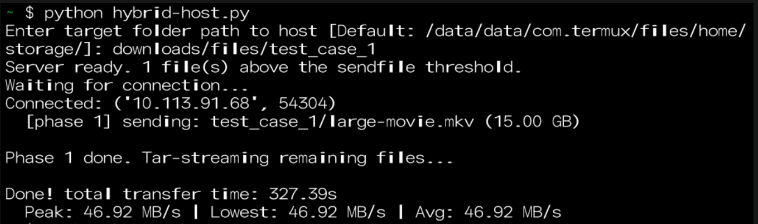
* **Client (Windows PowerShell):**
  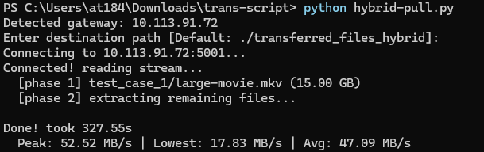

##### Performance & Speed Logic Summary
* **Speeds Achieved:**
  * **Host:** Peak: `46.92 MB/s` | Lowest: `46.92 MB/s` | Avg: `46.92 MB/s`
  * **Client:** Peak: `52.52 MB/s` | Lowest: `17.83 MB/s` | Avg: `47.09 MB/s`
  * **Duration:** `327.55 seconds`
* **Performance Analysis & Speed Difference:**
  * **Logic:** Zero-copy transfers the single 15 GB monolith via a kernel-level `sendfile()` pipeline, bypassing userspace RAM buffers to saturate the local network interface.
  * **Speed Difference:**
    * **Host Logging:** Since Test Case 1 contains only a single massive file, the host logs a single sample for the entire transfer, resulting in Peak = Lowest = Avg = `46.92 MB/s`.
    * **Client Logging:** The client samples throughput dynamically every 8MB. This reveals transient fluctuations—such as network buffering anomalies or disk write backlog spikes on Windows—showing a Peak of `52.52 MB/s` and a Lowest of `17.83 MB/s`. The client's calculated average (`47.09 MB/s`) is slightly higher than the host's overall average due to high-resolution timer differences and connection start overhead being bundled into the host's single overall measurement.

---

#### 📊 Test Case 2: The Deep Web (~5.12 GB)
* **Folder Structure:** [Test Case 2 Structure](Testing/Host_as_Android/test_case_2/struct_2.txt)
* **Transfer Mode:** Pure Phase 2 (Live Tar Stream)

##### Output Screenshots
* **Host (Android Termux):**
  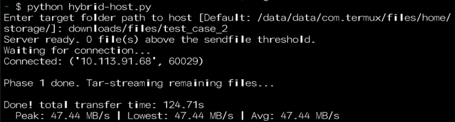
* **Client (Windows PowerShell):**
  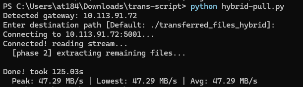

##### Performance & Speed Logic Summary
* **Speeds Achieved:**
  * **Host:** Peak: `47.44 MB/s` | Lowest: `47.44 MB/s` | Avg: `47.44 MB/s`
  * **Client:** Peak: `47.29 MB/s` | Lowest: `47.29 MB/s` | Avg: `47.29 MB/s`
  * **Duration:** `125.03 seconds`
* **Performance Analysis & Speed Difference:**
  * **Logic:** Because all files are under the 5 GB threshold, the payload is bundled on-the-fly and streamed via the Phase 2 live Tar pipeline. Directory walking and metadata packaging introduce slight overhead compared to direct Zero-Copy.
  * **Speed Difference:**
    * **Host vs. Client Sampling:** In Phase 2, both scripts compute exactly one speed sample for the entire tar stream duration (rather than checking block-by-block). As a result, both devices show identical Peak, Lowest, and Average values (`47.44 MB/s` on the Host, `47.29 MB/s` on the Client).
    * **Discrepancy:** The host reads the assets from flash memory and feeds them directly to the socket. The client must parse headers, create subdirectories, and write multiple individual files to Windows NTFS storage, resulting in a slightly lower overall transfer speed (`47.29 MB/s` vs. `47.44 MB/s`) due to disk write and metadata indexing latency on the PC.

---

#### 📊 Test Case 3: The Chaos Pack (~36.21 GB)
* **Folder Structure:** [Test Case 3 Structure](Testing/Host_as_Android/test_case_3/struct_3.txt)
* **Transfer Mode:** Hybrid (Phase 1 Zero-Copy followed by Phase 2 Tar Stream)

##### Output Screenshots
* **Host (Android Termux):**
  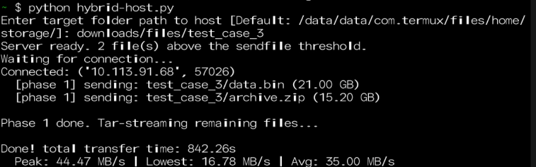
* **Client (Windows PowerShell):**
  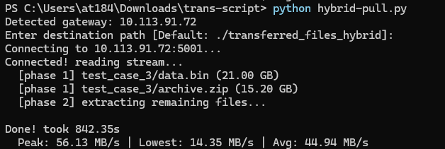

##### Performance & Speed Logic Summary
* **Speeds Achieved:**
  * **Host:** Peak: `44.47 MB/s` | Lowest: `16.78 MB/s` | Avg: `35.00 MB/s`
  * **Client:** Peak: `56.13 MB/s` | Lowest: `14.35 MB/s` | Avg: `44.94 MB/s`
  * **Duration:** `842.35 seconds`
* **Performance Analysis & Speed Difference:**
  * **Logic:** Validates the dynamic state shift of UnMTP. Large files (>5 GB) are sent via Phase 1 Zero-Copy (driving speeds up to `56.13 MB/s`), and small files are packaged and piped via Phase 2 Tar streaming (where file creation and write overhead cause speeds to drop to a low of `14.35 MB/s`).
  * **Speed Difference:**
    * **Why Client Average is Higher:** The Host calculates average speed from only 3 samples: one for each of the two Phase 1 zero-copy files, and one for the entire Phase 2 Tar streaming phase. The low speed of the Tar phase (~`16.78 MB/s`) drags the host average down to `35.00 MB/s` (representing a simple math average: `(sample1 + sample2 + sample3)/3`), giving the tiny files disproportionate weight. The Client, however, collects samples every 8MB throughout the 36.21 GB zero-copy phase (thousands of samples) plus 1 sample at the end of the tar phase. The high-speed zero-copy samples dominate the client's calculations, resulting in a more representative weighted average speed of `44.94 MB/s`.
    * **Peak & Lowest Variations:** The client logs a Peak of `56.13 MB/s` during zero-copy network bursts and a Lowest of `14.35 MB/s` during small-file disk write phases.
> Just so you know, in some cases I've reached a maximum speed of 1488 MB/s (11.625 Gb/s).

---

### Host as Windows (Windows → Android)

To evaluate UnMTP's performance with Windows as the server, we created a test suite using the script: [test_case_generation.ps1](Testing/Host_as_Windows/test_case_generation.ps1).

#### Generating the Test Suite
To run these test cases, open PowerShell and run:
```powershell
.\test_case_generation.ps1
```

---

#### 📊 Test Case 1: The Monolith (15.00 GB)
* **Folder Structure:** [Test Case 1 Structure](Testing/Host_as_Windows/test_case_1/struct_1.txt)
* **Transfer Mode:** Pure Phase 1 (Zero-Copy)

##### Output Screenshots
* **Host (Windows PowerShell):**
  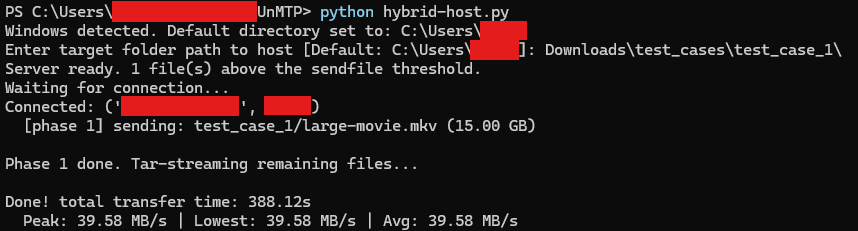
* **Client (Android Termux):**
  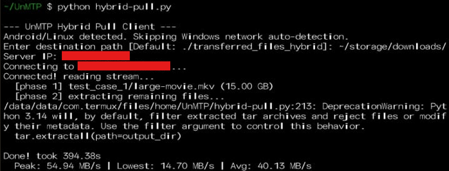

##### Performance & Speed Logic Summary
* **Speeds Achieved:**
  * **Host:** Peak: `39.58 MB/s` | Lowest: `39.58 MB/s` | Avg: `39.58 MB/s`
  * **Client:** Peak: `54.94 MB/s` | Lowest: `14.70 MB/s` | Avg: `40.13 MB/s`
  * **Duration:** `388.12 seconds`
* **Performance Analysis & Speed Difference:**
  * **Logic:** Same zero-copy `sendfile()` pipeline as the Android host, but operating in the reverse direction—Windows reads the 15 GB monolith from NTFS and pushes it over the socket to the Android client writing to ext4/sdcardfs.
  * **Speed Difference:**
    * **Host Logging:** Single file means the host logs one sample for the entire transfer: Peak = Lowest = Avg = `39.58 MB/s`. This is slightly lower than the Android-hosted equivalent (`46.92 MB/s`) because Windows NTFS read I/O and Winsock buffering introduce marginally more overhead than Android's Linux kernel `sendfile()` path.
    * **Client Logging:** The Android client samples throughput every 8MB, revealing a Peak of `54.94 MB/s` during network bursts and a Lowest of `14.70 MB/s` during Android storage write latency spikes (sdcardfs/FUSE overhead). The client average (`40.13 MB/s`) closely matches the host's overall measurement.

---

#### 📊 Test Case 2: The Deep Web (~5.12 GB)
* **Folder Structure:** [Test Case 2 Structure](Testing/Host_as_Windows/test_case_2/struct_2.txt)
* **Transfer Mode:** Pure Phase 2 (Live Tar Stream)

##### Output Screenshots
* **Host (Windows PowerShell):**
  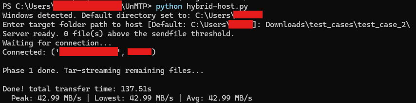
* **Client (Android Termux):**
  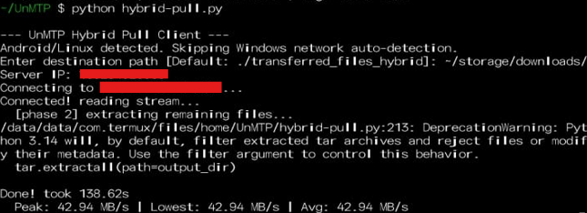

##### Performance & Speed Logic Summary
* **Speeds Achieved:**
  * **Host:** Peak: `42.99 MB/s` | Lowest: `42.99 MB/s` | Avg: `42.99 MB/s`
  * **Client:** Peak: `42.94 MB/s` | Lowest: `42.94 MB/s` | Avg: `42.94 MB/s`
  * **Duration:** `137.51 seconds`
* **Performance Analysis & Speed Difference:**
  * **Logic:** All files fall under the 5 GB threshold, so the entire payload is bundled on-the-fly by the Windows host and streamed via the Phase 2 live Tar pipeline to the Android client.
  * **Speed Difference:**
    * **Host vs. Client Sampling:** Same as the Android-hosted scenario—Phase 2 produces a single speed sample for the entire tar stream. Both devices report nearly identical values (`42.99 MB/s` Host, `42.94 MB/s` Client).
    * **Discrepancy:** The Windows host reads files from NTFS and packages them into the tar stream. The Android client must parse headers, create deeply nested subdirectories on ext4/sdcardfs, and write individual files—resulting in a marginally lower throughput (`42.94 MB/s` vs. `42.99 MB/s`). The overall throughput is slightly lower than the Android-hosted equivalent (`47.44 MB/s`) due to NTFS directory-walking overhead when reading many small files across nested folders.

---

#### 📊 Test Case 3: The Chaos Pack (~36.21 GB)
* **Folder Structure:** [Test Case 3 Structure](Testing/Host_as_Windows/test_case_3/struct_3.txt)
* **Transfer Mode:** Hybrid (Phase 1 Zero-Copy followed by Phase 2 Tar Stream)

##### Output Screenshots
* **Host (Windows PowerShell):**
  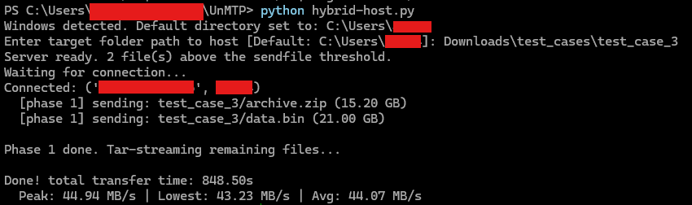
* **Client (Android Termux):**
  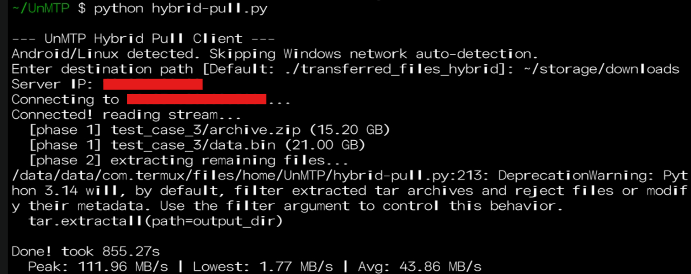

##### Performance & Speed Logic Summary
* **Speeds Achieved:**
  * **Host:** Peak: `44.94 MB/s` | Lowest: `43.23 MB/s` | Avg: `44.07 MB/s`
  * **Client:** Peak: `111.96 MB/s` | Lowest: `1.77 MB/s` | Avg: `43.86 MB/s`
  * **Duration:** `848.50 seconds`
* **Performance Analysis & Speed Difference:**
  * **Logic:** Same hybrid state transition as the Android-hosted scenario. The two massive files (15.2 GB `archive.zip` and 21 GB `data.bin`) are sent via Phase 1 Zero-Copy, and the 105+ small files under `small-files/` are packaged and piped via Phase 2 Tar streaming.
  * **Speed Difference:**
    * **Why Host Average is More Stable:** The Windows host reports a tighter Peak-to-Lowest range (`44.94` to `43.23 MB/s`) because it's measuring per-file send throughput from NTFS reads—both large files are read sequentially from SSD at consistent speeds. The host average of `44.07 MB/s` reflects this stability.
    * **Why Client Peak is Extremely High:** The Android client samples throughput every 8MB. During the zero-copy phase, the client hit a burst Peak of `111.96 MB/s`—likely a kernel-level TCP receive buffer flush where accumulated buffered data was written to storage in a single measurement window. The Lowest of `1.77 MB/s` represents the Android client's sdcardfs/FUSE write stalls during small-file creation in Phase 2, where per-file `open()`/`close()` syscall overhead dominates.
    * **Duration Comparison:** The total transfer time of `848.50 seconds` is comparable to the Android-hosted equivalent (`842.35 seconds`), confirming that the hybrid pipeline performs symmetrically regardless of which device serves as host.

---

## 🤝 Contributing

Pull requests are welcome. For major changes, please open an issue first to discuss what you would like to change. This is my own thing that i needed for a long time so if you think how can someone make something this stupid, then just so you know, IDGAF. Thank you!! ;)
> [Note] : You can look at the [base-scripts/](./base-scripts/) to get a grasp on how the 2 segments of hybrid script is running. Then you can refer to [walkthrough.html](./walkthrough.html) to understand everything about this project.

---

## 📄 License

This project is open source. Do whatever you want with it.
